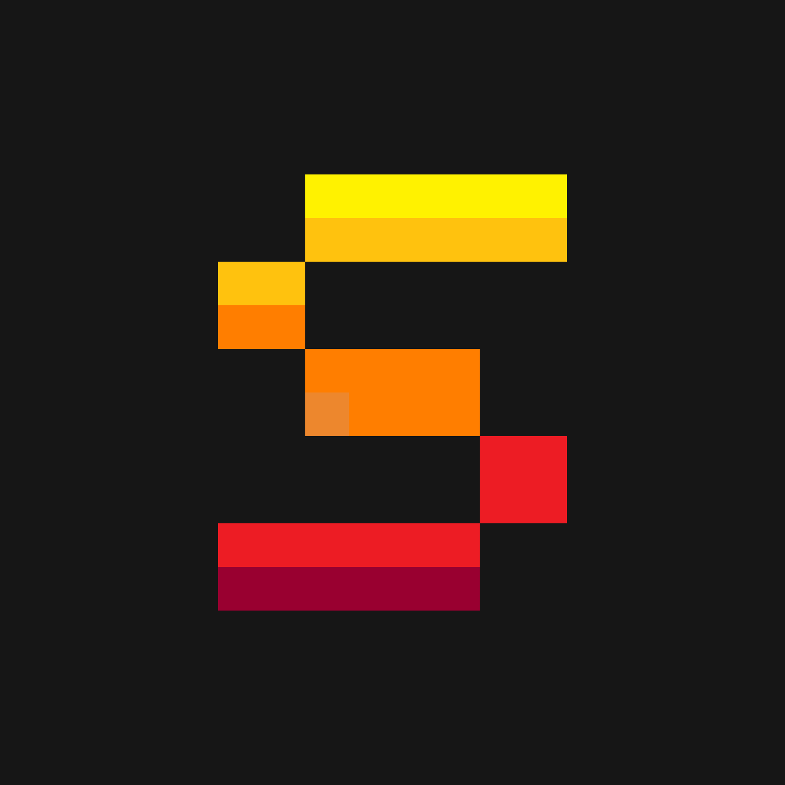
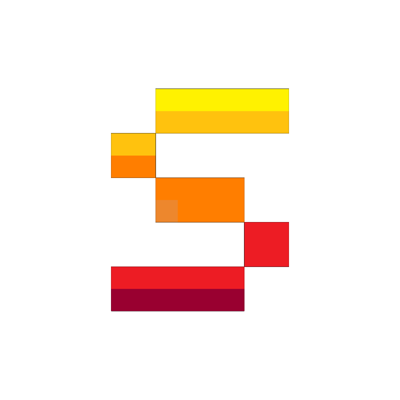
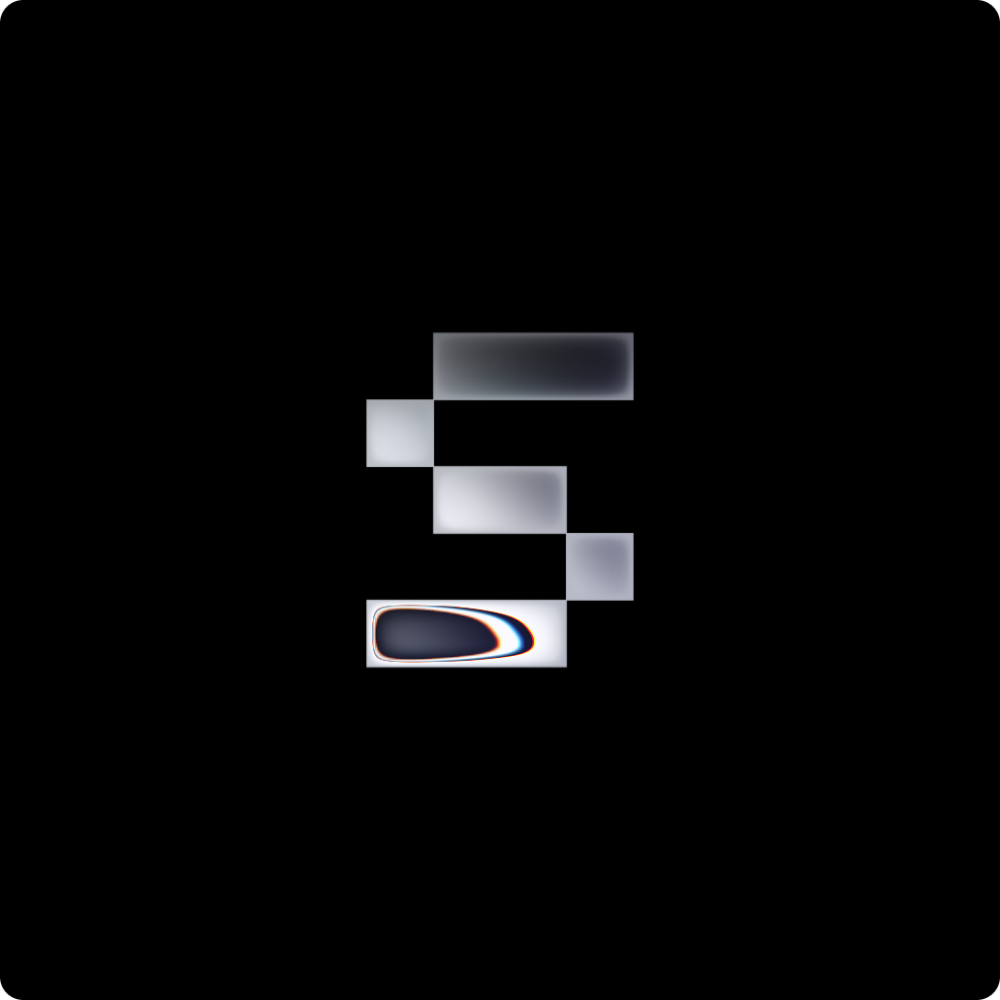

# brand
This repository holds all the core brand assets for Solace Organization.

## Assets
### Logo
* Dark:
  
  
* Light:

  

* Liquid Metal:
  
    

### Banner
* Dark:

  

* Light: Unavailable

## Colors
* Burgundy: [#990030](https://imagecolorpicker.com/color-code/990030)
* Crimson: [#ed1c24](https://imagecolorpicker.com/color-code/ed1c24)
* Flush Orange: [#ff7e00](https://imagecolorpicker.com/color-code/ff7e00)
* Supernova: [#ffc20e](https://imagecolorpicker.com/color-code/ffc20e)
* Yellow: [#fff200](https://imagecolorpicker.com/color-code/fff200)

## License
All brand assets for Solace are licensed under the CC BY-NC-ND license, see the [LICENSE](LICENSE) file for more information.
